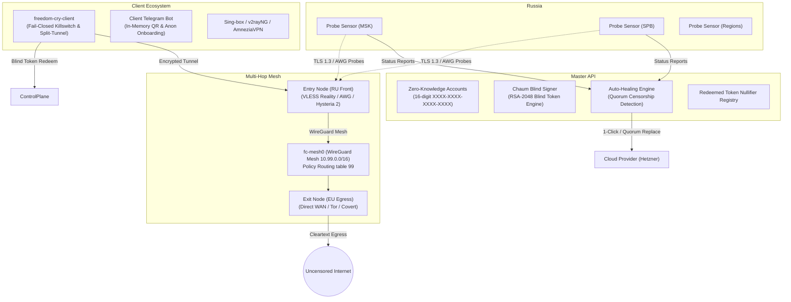
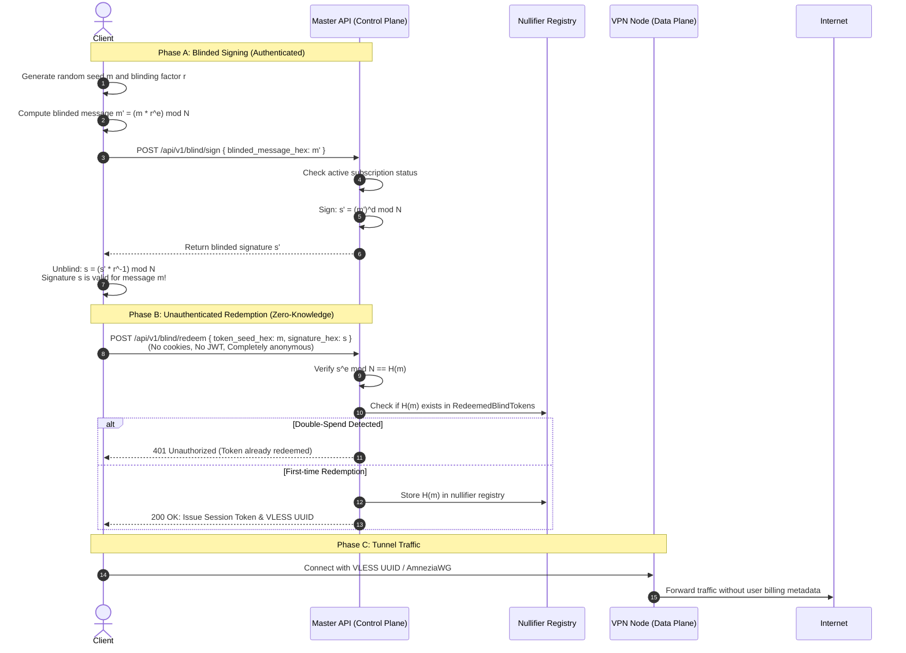
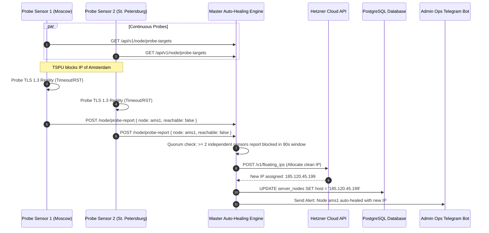

# Freedom Cry 2.0 — Next-Gen Architecture & Threat Model

> **Mission**: Build an ultra-resilient, self-healing, Zero-Knowledge censorship-resistant VPN network specifically engineered to defeat state-level Deep Packet Inspection (DPI / TSPU) while maintaining absolute user privacy and fail-closed security.

---

## 1. High-Level Architecture Overview

Freedom Cry 2.0 decouples the **Control Plane** (billing, account management, sensor telemetry) from the **Data Plane** (tunnel transport, traffic egress) using cryptographic blind signatures (RFC 9505 / Chaum Blind Signatures).



---

## 2. Phase 1: Zero-Knowledge Data Plane (Chaum Blind Signatures)

To achieve complete zero-knowledge privacy, client subscription payments are separated from tunnel sessions. The server signs a blinded token without learning its underlying content.



### Dynamic VLESS UUID Rotation
- Every active key has a primary UUID and a `previous_uuid` with a **1-hour grace period**.
- When a key rotates, existing sessions remain uninterrupted for 60 minutes, eliminating disconnections.

---

## 3. Phase 2: Multi-Hop Routing (Entry $\to$ Exit Mesh Chaining)

When direct access from Russia to foreign exit nodes is blocked or heavily inspected, traffic is routed through a resilient Entry $\to$ Exit chain:

```mermaid
flowchart LR
    Client["Client Traffic"] -->|VLESS Reality / Hysteria 2| Entry["Entry Node (RU-Friendly IP)"]
    subgraph Mesh Network ["Internal WireGuard Mesh (fc-mesh0: 10.99.0.0/16)"]
        Entry -->|Policy Routing (table 99, fwmark 0x99)| Exit["Exit Node (EU / US)"]
    end
    Exit -->|Direct Outbound| WAN["Target Website / Service"]

    subgraph Fail-Closed Protection
        Entry -.->|Block Direct WAN| Blackhole["Drop Direct WAN Traffic on Entry"]
    end
```

- **Policy Routing**: On Entry nodes, client traffic is tagged with `fwmark 0x99` and forced into routing table `99`, where the default gateway is `10.99.0.1` (`fc-mesh0`).
- **Fail-Closed**: Entry nodes drop non-mesh transit packets, preventing IP exposure.

---

## 4. Phase 3: Censorship Circumvention 2.0 Protocols

Freedom Cry 2.0 supports a hybrid transport matrix:

| Protocol | Transport | Obfuscation / Camouflage | Primary Target |
| :--- | :--- | :--- | :--- |
| **VLESS Reality** | TLS 1.3 | Active SNI pool probes, Chrome/Firefox uTLS fingerprints | DPI SNI filtering & Active Probing |
| **AmneziaWG** | UDP | Randomized headers `H1..H4`, junk packet padding `Jc/Jmin/Jmax` | WireGuard UDP packet classifiers |
| **Hysteria 2** | QUIC | Salamander XOR obfuscation, Brutal congestion control | High-loss, throttling networks |
| **Covert WebRTC** | SCTP / DTLS | WebRTC DataChannels mimicking peer-to-peer video calls | Strict whitelist environments |
| **Covert CUPS / Yandex** | HTTP / Storage | IPP print stream encapsulation, encrypted cloud chunks | Corporate firewalls |

---

## 5. Phase 4: Fleet Automation & Auto-Healing Quorum



---

## 6. Phase 5: Client Ecosystem (`cmd/client`)

The native Go client CLI provides fail-safe, zero-leakage connectivity:

1. **Fail-Closed Firewall Kill-Switch**:
   - Implemented using native Linux `nftables` (with automatic fallback to `iptables`).
   - Default policy: `DROP` for `OUTPUT` and `FORWARD`.
   - Complete drop of all IPv6 traffic (`ip6tables -P OUTPUT DROP` / nftables inet drop) to prevent IPv6 leakage when the tunnel operates on IPv4.
   - White-lists LAN traffic (`10.0.0.0/8`, `172.16.0.0/12`, `192.168.0.0/16`) and established/related connections.
   - Traffic can only leave via the VPN interface (`fc-tun0`) or directly to the VPN endpoint.

2. **Russian Domestic Split-Tunneling**:
   - Direct routing (`DIRECT`) for Russian public services (`gosuslugi.ru`, `nalog.gov.ru`, `mos.ru`), banks (`sber.ru`, `tinkoff.ru`, `vtb.ru`), domestic portals (`yandex.ru`, `vk.com`, `ozon.ru`), and domestic TLDs (`.ru`, `.su`, `.рф`).
   - Encrypted tunnel routing (`TUNNEL`) for foreign and censored resources (`instagram.com`, `twitter.com`, `x.com`, `chatgpt.com`, `rutracker.org`, `meduza.io`).

3. **DeepLink Protocol Integration**:
   - Handles `freedomcry://connect?sub=...&account=...` links seamlessly.

---

## 7. Phase 6: Telegram Bot Ecosystem

### 7.1 Client Telegram Bot (`cmd/bot/client`)
- **Zero-Knowledge Onboarding**: Automatically allocates anonymous 16-digit account numbers (`XXXX-XXXX-XXXX-XXXX`). No Telegram ID is stored in the user account record.
- **In-Memory QR Code Delivery**: Uses pure RAM buffers (`bytes.Buffer` + `github.com/skip2/go-qrcode`) delivered as multipart PNG data directly to Telegram. **Zero temporary files or credentials are ever written to disk.**
- **Interactive Controls**: Instant config retrieval, key rotation, protocol guide.

### 7.2 Admin Operations Bot (`cmd/bot/admin`)
- **Zero-Trust Security**:
  - Strict Telegram ID whitelist (`ADMIN_TELEGRAM_IDS`).
  - 2FA MFA OTP session verification (`/auth <secret>`).
- **Fleet Dashboard**: Live node health, country, load %, and latency status.
- **Sensor Probing Radar**: Real-time TSPU block reports from regional sensors.
- **1-Click Auto-Healing Override**: Trigger immediate Floating IP replacement via Hetzner Cloud API.
- **Emergency Panic Button**: Global revocation and instant token rotation with 1-hour grace period.

---

## 8. Threat Model & Security Invariants

| Threat Scenario | System Response / Mitigation |
| :--- | :--- |
| **Database Compromise (Control Plane)** | Attacker gains no link between payment/billing records and user VPN tunnels due to Chaum Blind Signatures and nullifiers. Private keys are not stored in database tables. |
| **Node Seizure (Data Plane)** | Nodes only possess public keys of other nodes and transient peer sessions; Master holds no private node keys in database schemas. |
| **TSPU SNI / Protocol Throttling** | Multi-transport failover (VLESS-Reality $\to$ AmneziaWG $\to$ Hysteria 2 $\to$ WebRTC). SNI pool periodically probes and rotates to reputable domains. |
| **Sudden Tunnel Drop** | Client Kill-switch drops all outbound packets instantly via `nftables`/`iptables`. No unencrypted packets reach ISP gateway. |
| **Admin Bot Credential Leak** | Access requires matching Telegram ID whitelist AND active MFA passkey. Unauthenticated sessions are rejected. |
